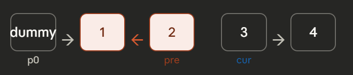

## 本篇题目

::leetcode{id="25" title="Reverse Nodes in k-Group" zh="K个一组翻转链表" difficulty="hard"}
::leetcode{id="50" title="Pow(x, n)" zh="Pow(x, n)" difficulty="medium"}

---

## LeetCode 25 · K个一组翻转链表

::leetcode{id="25" title="Reverse Nodes in k-Group" zh="K个一组翻转链表" difficulty="hard"}

### 思路

整体分两层逻辑：

**外层 while 循环**：每次处理一组 k 个节点。先统计链表总长度 `n`，每轮 `n -= k`，只要 `n >= k` 就说明还有完整的一组可以处理，不够 k 个则直接保留原样退出。

**内层 for 循环**：对当前组的 k 个节点做标准链表反转（和 LeetCode 206 完全一样），循环 k 次，每次把 `curr.next` 指向 `prev`，然后 `prev`、`curr` 各往右移一步。

**for 结束后接回主链表**：反转完一组之后，这组在链表里是"断开"的状态，需要重新把它拼回去。用 `p0` 指针记录每组的前驱节点（即上一组的尾巴），依次完成四步接线操作。

```
反转前：... → p0 → [1 → 2] → 3 → ...
反转后（for结束）：       2 → 1 → None，curr 在 3
接回后：... → p0 → 2 → 1 → 3 → ...，p0 移到 1
```

for循环退出去之后脑子里要有这个图片 根据这个图片重新连接指针



### 代码

```python
class Solution:
    def reverseKGroup(self, head: Optional[ListNode], k: int) -> Optional[ListNode]:
        
        # 统计链表总长度
        n = 0
        curr = head
        while curr:
            n += 1
            curr = curr.next

        # 哨兵节点，p0 始终指向当前组的前驱节点
        p0 = dummy = ListNode(next=head)
        prev = None
        curr = head

        # 剩余节点够 k 个才处理，不够直接保留原样
        while n >= k:
            n -= k

            # 组内反转 k 次，和翻转链表模板完全一致
            for _ in range(k):
            
		            # 下面和翻转链表代码一样
                # 先保存当前节点的下一个节点
                # 再将当前节点的下一个节点指向prev,断开和原先下一个节点的连接
                # prev和curr指针各往右走一步 准备开始新一轮翻转
                
                node = curr.next      # 保存下一个节点，防止断链后找不到
                curr.next = prev      # 当前节点反向指向 prev
                prev = curr           # prev 右移
                curr = node           # curr 右移

            # 反转完成后，接回主链表
            # 当这组翻转完之后 类似于for循环里面的翻转逻辑 我们还需要对整组进行重新连接
            # 首先保存这一组的头节点 防止断链之后找不到
            # 接着将这一组的头节点指向curr指针 因为现在curr在新的一组的开头了
            # 然后将p指针指向这一组的尾节点 也就是prev 因为此时的位置是prev在这一组的尾节点 而curr在新一组的头节点
            # prev永远在curr左边
            # 最后重新设置p 移动到 grouped_first_node
            grouped_first_node = p0.next      # 记录这组的尾巴（反转前的头）
            grouped_first_node.next = curr    # 尾巴接上下一组的头
            p0.next = prev                    # p0 接上这组反转后的头
            p0 = grouped_first_node           # p0 移动到这组的尾巴，准备下一轮

        return dummy.next
```

### 关键细节

**为什么要先统计长度 `n`？**

用 `while n >= k` 来判断剩余节点是否够一组。如果不统计长度，就不知道什么时候该停，容易在 `curr` 为 `None` 时还继续执行 for 循环，导致 `curr.next` 报 `AttributeError`。

**`while n >= k` 而不是 `while n`**

`n -= k` 之后 `n` 可能变成负数，Python 里负数是 truthy，循环不会停。必须用 `>= k` 明确判断剩余长度。

**接回主链表的四行顺序不能乱**

```python
grouped_first_node = p0.next      # ① 先保存尾巴，否则 p0.next 被覆盖后就找不到了
grouped_first_node.next = curr    # ② 尾巴接下一组
p0.next = prev                    # ③ p0 接这组的新头
p0 = grouped_first_node           # ④ p0 移动到尾巴，准备下一轮
```

①必须在③之前：③会覆盖 `p0.next`，如果先执行③，`grouped_first_node` 就拿不到原来的值了。

**`grouped_first_node.next = curr` 不是 `grouped_first_node = curr`**

前者是修改节点的 `next` 指针（改链表结构），后者只是给变量重新赋值，不影响任何节点的连接关系。

**`prev` 在进入下一轮 while 时不需要重置**

for 循环结束时 `prev` 指向这组的头节点，`p0.next = prev` 把它接好之后，下一轮 for 循环会继续用同一个 `prev` 变量，它会被 `curr.next = prev` 覆盖，自然过渡，不需要手动重置为 `None`。

### 总结

- **核心技巧**：外层 while 控制分组 + 内层 for 做标准链表反转 + 四行接回主链表
- **`p0` 的作用**：始终指向"已处理部分的最后一个节点"，每轮反转完成后移动到本组尾巴
- **复杂度**：时间 O(n)，空间 O(1)

| 步骤 | 对应代码 | 作用 |
| --- | --- | --- |
| 统计长度 | `while curr: n += 1` | 判断剩余够不够 k 个 |
| 分组控制 | `while n >= k: n -= k` | 不够 k 个则保留原样 |
| 组内反转 | `for _ in range(k)` | 标准链表反转，执行 k 次 |
| 接回主链表 | 四行接线 | 把反转好的小段拼回大链表 |

---

## LeetCode 50 · Pow(x, n)

::leetcode{id="50" title="Pow(x, n)" zh="Pow(x, n)" difficulty="medium"}

### 思路

朴素做法是把 `x` 连乘 `n` 次，时间复杂度 O(n)。当 `n` 很大时（比如 10⁹）会超时。

快速幂的核心思想是把指数 `n` 用二进制表示，利用二进制分解来跳过大量重复计算。

以 `x=2, n=9` 为例，`9 = 1001₂`，所以：

```
x⁹ = x^(1×1) × x^(0×2) × x^(0×4) × x^(1×8)
   = x¹ × x⁸
```

只需要计算二进制位为 **1** 的那几项，其余跳过。这样循环次数等于 `n` 的二进制位数，也就是 O(log n)。

具体做法：从 `n` 的最低位开始从右往左扫，每轮检查当前位是否为 1，是则把当前的 `x` 乘进结果；同时 `x` 自己平方（`x¹ → x² → x⁴ → x⁸ ...`），`n` 右移一位进入下一位的检查。

```
n = 1001
第1轮：最低位=1 → res×=x¹，x变x²，n右移→100
第2轮：最低位=0 → 跳过，  x变x⁴，n右移→10
第3轮：最低位=0 → 跳过，  x变x⁸，n右移→1
第4轮：最低位=1 → res×=x⁸，x变x¹⁶，n右移→0，结束
res = x¹ × x⁸ = x⁹ ✓
```

### 代码

```python
class Solution:
    def myPow(self, x: float, n: int) -> float:
        if x == 0.0: return 0.0
        res = 1
        if n < 0: x, n = 1 / x, -n   # 负指数转成正指数
        while n:
            if n & 1: res *= x         # 当前最低位是 1，把 x 收进结果
            x *= x                     # x 自己平方，准备下一位
            n >>= 1                    # n 右移一位，检查下一位
        return res
```

### 关键细节

**`n & 1` 是什么**

按位与运算，`1` 的二进制是 `0001`，`n & 1` 的效果是只看 `n` 的最低位：

```
1001 & 0001 = 0001 = 1  → 最低位是 1
1000 & 0001 = 0000 = 0  → 最低位是 0
```

**`n >>= 1` 是什么**

右移一位，相当于把 `n` 的二进制整体向右移，最低位被丢弃，等价于 `n //= 2`：

```
1001 >> 1 = 100
100  >> 1 = 10
10   >> 1 = 1
1    >> 1 = 0  → 循环结束
```

**`x *= x` 每轮都执行，不管当前位是 0 还是 1**

`x` 的平方是给下一轮准备的，和当前位是否为 1 无关：

```
第1轮：x = x¹ → 平方后变 x²（给第2轮用）
第2轮：x = x² → 平方后变 x⁴（给第3轮用）
第3轮：x = x⁴ → 平方后变 x⁸（给第4轮用）
```

**负指数处理**

`x^(-n) = (1/x)^n`，所以负指数时把 `x` 换成 `1/x`，`n` 取绝对值，后续逻辑完全一样。

### 总结

- **核心思想**：把指数 `n` 二进制分解，只把二进制位为 1 的幂次乘进结果
- **`res` 的作用**：收集袋，遇到二进制位为 1 就往里装当前的 `x`
- **复杂度**：时间 O(log n)，空间 O(1)

| 操作 | 含义 |
| --- | --- |
| `n & 1` | 检查 n 的最低位是 0 还是 1 |
| `res *= x` | 当前位为 1，把这个幂次收进结果 |
| `x *= x` | x 自己平方，准备下一位 |
| `n >>= 1` | 右移，丢弃已处理的最低位 |