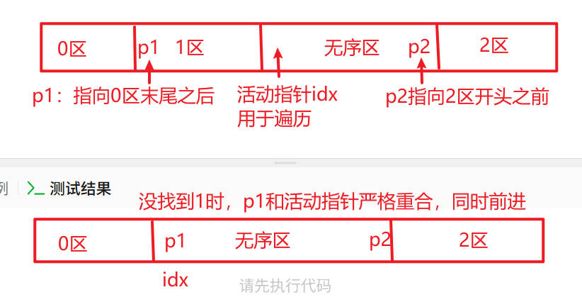

## 本篇题目

::leetcode{id="75" title="Sort Colors" zh="颜色分类" difficulty="medium"}
::leetcode{id="142" title="Linked List Cycle II" zh="环形链表 II" difficulty="medium"}
::leetcode{id="11" title="Container With Most Water" zh="盛最多水的容器" difficulty="medium"}
::leetcode{id="42" title="Trapping Rain Water" zh="接雨水" difficulty="hard"}

---

## 一、双指针：Dutch National Flag

### 75. 颜色分类

::leetcode{id="75" title="Sort Colors" zh="颜色分类" difficulty="medium"}

**核心思路：三指针将数组划分为四个区间，始终维护：**

```
[0区 | p1  1区  idx  无序区  p2 | 2区]
```

- `[0, p1)` 已确认的 0
- `[p1, idx)` 已确认的 1
- `[idx, p2]` 待处理的未知区域
- `(p2, end]` 已确认的 2

**三种操作：**

- `idx` 遇到 0 → 和 `p1` 交换，`p1++`，`idx++`（换来的一定是 1，安全跳过）
- `idx` 遇到 2 → 和 `p2` 交换，`p2--`，`idx` 不动（换来的未知，需要重检）
- `idx` 遇到 1 → 只 `idx++`

**为什么遇到 2 时 idx 不动？**

`p2` 是无序区的右边界，它右边虽然是已确认的 2，但 `p2` 本身没有被扫描过，换来的可能是 0、1、2 任何一种，必须停在原地再判断一次。

**终止条件：** `idx > p2`，未知区域缩小为空。

可以参考这张图：



```python
class Solution:
    def sortColors(self, nums: List[int]) -> None:
        l = 0
        r = len(nums) - 1
        i = 0

        while i <= r:
            if nums[i] == 0:
                nums[l], nums[i] = nums[i], nums[l]
                l += 1
            elif nums[i] == 2:
                nums[i], nums[r] = nums[r], nums[i]
                r -= 1
                i -= 1  # 抵消末尾的 i += 1，让 i 原地重检
            i += 1
```

> 💡 `i -= 1` 再 `i += 1` 两步抵消，等效于 i 不移动——每轮循环统一在末尾 `+1`，逻辑更统一。
> 

---

## 二、哈希集合：检测环入口

### 142. 环形链表 II

::leetcode{id="142" title="Linked List Cycle II" zh="环形链表 II" difficulty="medium"}

**核心思路：用 set 记录访问过的节点对象，第一次重复出现的节点就是环的入口。**

- set 存的是**节点对象本身**（内存地址），不是 `val`
- 即使两个节点 val 相同，只要不是同一个对象就不会误判

```python
class Solution:
    def detectCycle(self, head: Optional[ListNode]) -> Optional[ListNode]:
        curr = head
        seen = set()

        while curr:
            if curr in seen:
                return curr
            seen.add(curr)
            curr = curr.next  # ⚠️ 不能漏掉，否则死循环

        return None
```

> ⚠️ 常见错误：`seen.add(curr.val)` 会因为值相同的不同节点被误判为已访问。
> 

---

## 三、双指针：对撞指针

### 11. 盛最多水的容器

::leetcode{id="11" title="Container With Most Water" zh="盛最多水的容器" difficulty="medium"}

**核心思路：左右双指针对撞，每次移动较短的那边。**

面积 = `(r - l) × min(height[l], height[r])`，由短板决定。（注意这里不是r-l+1，因为我们要算的是两个数字中间的间隔）

- 移动较长的那边：宽度减小，高度不超过当前短板，面积只会更小，没有意义
- 移动较短的那边：才有可能遇到更高的柱子，面积才可能变大
- 等高时移动哪边都行，理由相同

```python
class Solution:
    def maxArea(self, height: List[int]) -> int:
        res = 0
        l, r = 0, len(height) - 1

        while l < r:
            area = (r - l) * min(height[l], height[r])
            res = max(res, area)

            if height[l] < height[r]:
                l += 1
            elif height[l] > height[r]:
                r -= 1
            else:
                l += 1  # 等高时移动哪边都可以

        return res
```

> 💡 暴力解 O(n²) 会超时，对撞双指针 O(n) 是正确思路。
> 

---

## 四、双指针：接雨水

### 42. 接雨水

::leetcode{id="42" title="Trapping Rain Water" zh="接雨水" difficulty="hard"}

**核心思路：木桶效应——每个位置能接的水由两侧最高木板中较矮的那块决定。**

把每个数字想象成直方图里对应高度的木板，用左右指针从两侧向中间夹逼：

- 维护 `leftMax`：左侧见过的最高木板
- 维护 `rightMax`：右侧见过的最高木板
- 每次移动较矮那侧的指针，用该侧历史最高值减去当前高度即为当前位置能接的水
- 如果差值为负，说明遇到了新的更高木板，`max` 自动更新基准，同时保证不会加上负数

**为什么移动较矮那侧？**

积水量由短板决定。如果 `leftMax < rightMax`，左边是瓶颈，右边再高也没用，只有移动左指针才有可能找到更高的左边界。

```python
class Solution:
    def trap(self, height: List[int]) -> int:
        if not height: return 0

        res = 0
        l, r = 0, len(height) - 1
        leftMax = height[l]
        rightMax = height[r] 

        while l < r:
            if leftMax < rightMax:
                l += 1
                leftMax = max(leftMax, height[l])
                res += leftMax - height[l]
            else:
                r -= 1
                rightMax = max(rightMax, height[r])
                res += rightMax - height[r]

        return res
```

---

## 五、双指针模板总结

### 模板一：对撞指针（左右夹逼）

适用场景：从两端向中间找答案，每次移动较小 / 较劣的那侧。

典型题目：11. 盛最多水、42. 接雨水、167. 两数之和 II

```python
l, r = 0, len(arr) - 1

while l < r:
    if 满足条件:
        # 处理结果
        l += 1  # 或 r -= 1
    elif 左边不够大:
        l += 1
    else:
        r -= 1
```

### 模板二：同向双指针（滑动窗口）

适用场景：维护一个连续区间 / 窗口，右指针扩张，左指针在窗口不合法时收缩。

典型题目：3. 无重复字符的最长子串、438. 找到字符串中所有字母异位词

```python
l = 0

for r in range(len(arr)):
    # 右指针扩张，加入新元素

    while 窗口不合法:
        # 左指针收缩
        l += 1

    # 更新答案
```

### 模板三：快慢指针（链表追及）

适用场景：链表判环、找中点、找倒数第 k 个节点。同向双指针的变体，slow 走 1 步，fast 走 2 步。

典型题目：141. 环形链表、142. 环形链表 II

```python
slow, fast = head, head

while fast and fast.next:
    slow = slow.next
    fast = fast.next.next
    if slow == fast:
        # 有环
        break
```

### 选哪种的判断依据

- 从两端往中间找 → **对撞指针**
- 维护一个连续区间 / 窗口 → **同向双指针（滑动窗口）**
- 链表追及 / 判环 / 找中点 → **快慢指针**