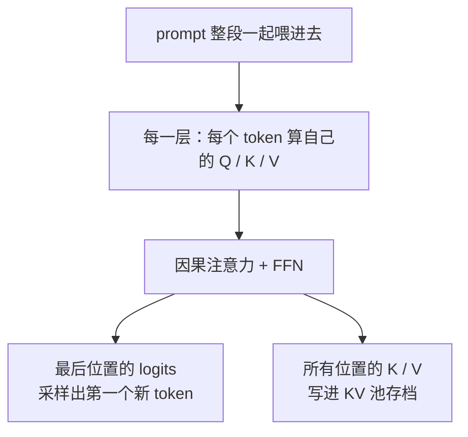
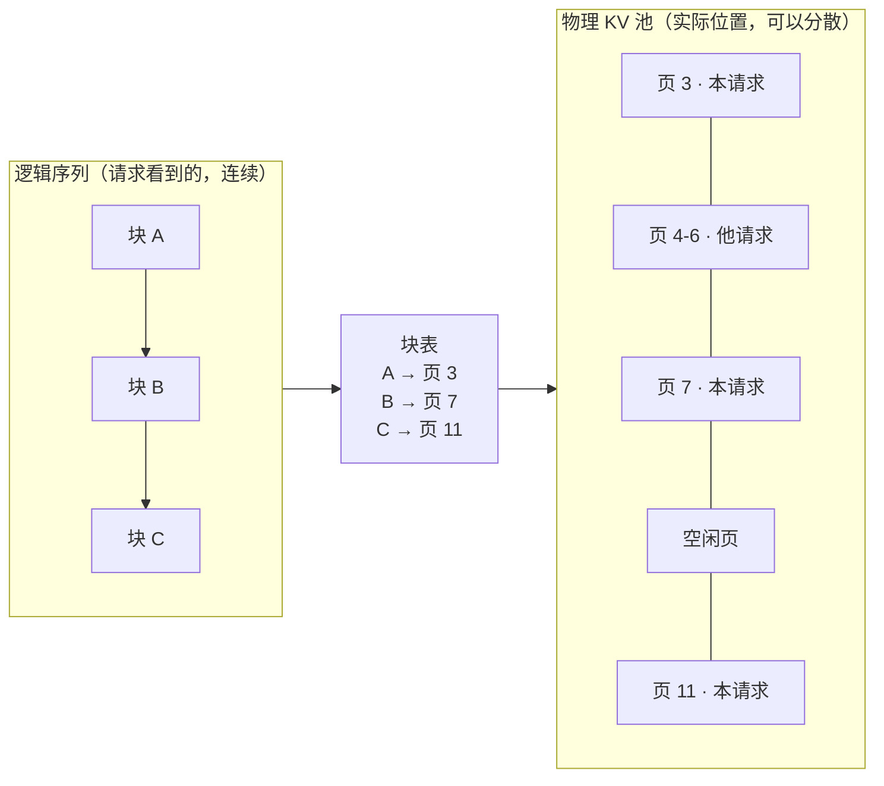
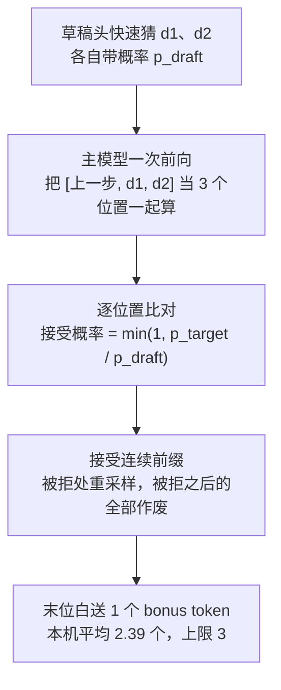

vLLM 是一个用于部署大语言模型的推理引擎。它要解决的不只是“模型能不能输出”，还包括权重、KV Cache 和计算工作区如何放进显存，以及多条请求怎样共享这些资源。

这篇记录的是在一张 22GB RTX 2080 Ti 上跑 vLLM fork 时的推导过程。它不把参数整理成一张需要背诵的清单，而是先说明几个躲不开的硬约束，再看 PagedAttention、KV Cache 和投机解码分别解决了什么问题。

2026-08-30 在单张魔改 RTX 2080 Ti 22GB 上跑 vLLM 0.1.17（SM75 fork）时边做边记，所有数字都是本机实测，日志出处在 [单卡 22GB 推理实验](/posts/22gb单卡推理实验记录/)。

阅读顺序很简单：先看三条约束，再看它们如何推导出具体机制。这样即使忘了某个参数，也能从约束重新推出来。想先看画面感的，可以打开 vLLM 请求生命周期动画演示。

文末有两张索引表，忘了细节直接翻，不用重读全文。

## 起点：三条约束

| 约束 | 说的是什么 | 后果落在谁头上 |
|---|---|---|
| 自回归 | 第 N 个 token 依赖前 N−1 个，生成必须一步一步走 | decode 的串行性，以及 KV Cache 的存在 |
| 带宽有限 | 每生成一个 token，都要把权重从显存搬一遍 | 单步耗时的下限 |
| 容量有限 | 权重、缓存、工作区必须一起塞进一张卡 | 能跑什么模型、能开多长上下文 |

本机这三条的具体数字：2080 Ti 22GB，显存带宽约 616 GB/s。后面每个结论都能拿这两个数验一遍。

## 一、约束一：自回归

模型生成第 N 个字时，得先知道前 N−1 个字是什么。这不是工程上偷懒，是"预测下一个字"这个任务本身的定义，写成概率就是 P(xₙ | x₁...xₙ₋₁)。所以生成 100 个字必然走 100 步，并行不了。

但有一个例外：**读题的时候不涉及生成**。prompt 是已经写好的，所有 token 都摆在那儿，不需要等谁。所以整个生成过程分成两段：

**Prefill（读题）**：把整段 prompt 一次算完，产出两样东西。

左边那路是给用户看的，第一个字什么时候出来就是大家说的 TTFT（首字延迟）。右边那路留给自己用。

prefill 能并行，靠的是因果 mask：第 i 个 token 只看 1..i、不看后面，所以整段的下三角矩阵一次乘法就完事。

**Decode（答题）**：之后每步只出一个 token。拿上一步刚生成的那个 token 算出 Q，和历史所有 K/V 做注意力，得到下一个字的概率分布，采样，进入下一步，直到模型吐出结束符。它没法并行，因为第 N 个字必须等第 N−1 个字出来才知道该关注什么。

生成时间里 99% 花在 decode 上。后面所有提速手段，基本全是冲着这一段去的。

#### 往下问：历史信息从哪来

decode 每一步都要和历史所有位置做注意力。这段历史只有两个来源：每步重算一遍，或者第一次算完存起来。

:::tip
**先自己推十秒：重算的代价是什么**
序列长 n，第 k 步要算 k 个位置，全程加起来是 n²/2。
生成 1000 个字的计算量是生成 100 个字的 **100 倍**，不是 10 倍。
:::

所以 KV Cache 不是什么优化技巧，是被 O(n²) 逼出来的唯一出路。它就是"把每一步算出来的 K、V 存下来，下一步直接翻"。

代价是显存。每 token 成本 = 全注意力层数 × 2（K 和 V）× head 数 × head_dim × 2 字节（FP16）。Qwen3.5-9B 拿这个公式算出来跟实测的 32.3KB 对得上。

#### 往下问：这十几个 GB 怎么分

一开始的做法很朴素：请求来了就划一整块连续显存。问题是请求长短不一，跑完释放之后留下大小不等的空洞，卡上明明还剩 8GB，却因为不连续而分不出一个 2GB 的请求。

vLLM 的解法借了操作系统虚拟内存的思路，也就是 PagedAttention：把池子切成固定大小的块，请求看到的逻辑块通过块表映射到物理块，物理上可以不连续。

三个名词新手最容易混，摆在一起看：

| 名字 | 是什么 | 本机实测 |
|---|---|---|
| 池（pool） | 启动时从显存预算一次性划出来的总缓存区 | 8K 配置下 188,847 tokens |
| 块（block） | 池子的等份，分配、复用、共享的最小单位 | 528 tokens，约 17MB |
| 块表（block table） | 逻辑块到物理块的映射表，跟操作系统页表一回事 | — |

这么切顺带白捡两个好处。碎片没了，块可以东拼西凑。更重要的是多个请求能指向同一批物理块，相同前缀只存一份只算一次，这就是 prefix cache。

也有个限制：块只能整块复用，末尾不满一块的部分每次都得重算。30 个 token 的短 prompt 连半块都凑不满，prefix cache 对它完全无效。我第一次测的时候拿一句短话去试，看到缓存命中率是 0 还以为坏了，其实是块粒度的问题。

#### 往下问：能不能少走几步

一步出 100 个字就得走 100 步。既然每步的耗时压不下去，那就减少步数。

MTP 的思路是：模型自带一个又小又快的草稿头，先猜接下来 2 个 token，交回主模型验证。

:::tip
**检验一下：验证 3 个位置，耗时大约是算 1 个的几倍**
提示：想想 prefill 为什么能并行，验证这一步走的更像 prefill 还是 decode。
答案：接近 1 倍，不是 3 倍。验证的时候三个位置都是已知 token，不存在"等下一个字"这回事，所以走的是 prefill 那条路，能一次算完。用并行换串行，MTP 的收益全在这一句里。
:::

判定接不接受，分两种情况。温度设 0（贪心）时，草稿 token 等于主模型 argmax 就接受。温度大于 0（采样）时用拒绝采样，接受概率是 `min(1, p_target / p_draft)`，被拒就从 `(p_target − p_draft)` 归一化后的分布重新采一个——这么设计是为了让最终输出分布跟直接用主模型采样在数学上等价，质量不打折。

另外只接受连续的前缀：第 i 个位置被拒，i 之后的全作废，因为它们都是基于被拒那个 token 才猜出来的。还有个白送的 bonus token：草稿全中时末位也算出了 logits，顺手再采样一个。所以 K=2 时上限是 3 个，本机实测平均 2.39，很接近天花板。

代价是验证工作区要吃显存，KV 池从 188,847 掉到 73,728，缩了六成。所以 MTP 和超长上下文天生打架，想要 262K 就别惦记 MTP。

开之前先确认两件事：模型 config 里有没有 `mtp_num_hidden_layers`，权重里草稿头在不在（社区量化经常直接砍掉）。

## 二、约束二：带宽有限

decode 每一步都要把全部权重从显存搬到计算单元，这是物理要求，绕不过去。所以单步耗时有个硬下限：权重体积 ÷ 带宽。

拿本机两个数验一下：

| 模型 | 权重 | 理论上限 | 实测 | 效率 |
|---|---|---|---|---|
| Qwen3.5-9B AWQ | 10.35 GiB（11.11 GB） | 616 ÷ 11.11 ≈ 55 tok/s | 41.0 tok/s | 74% |
| Qwen3.8-27B W4A16 | 17.2 GiB（18.47 GB） | 616 ÷ 18.47 ≈ 33 tok/s | 23.9 tok/s | 72% |

两个模型的效率都落在 72~74%，剩下的四分之一是调度和采样的固定开销，跟模型大小无关。这条可以当验真工具用：任何卡任何模型，实测速度低于理论上限的六成，说明有别的瓶颈在拖后腿，值得查；高于九成，八成是你忘了扣掉 prefill 的时间。

#### 往下问：怎么少搬一点

量化。权重从 16bit 压到 4bit，体积除以 4，每步要搬的数据也跟着除以 4。所以量化不只是省显存，它直接提速——这就是它成为单卡部署第一前提的原因。

AWQ 的思路是按激活值的重要性保护敏感权重，GPTQ 走误差重建（AutoRound 导出的就是 GPTQ 格式，加载时走 gptq_marlin 内核）。

#### 往下问：除了搬数据，还有什么别的事

有，调度。每步 CPU 都要安排一遍 GPU 内核怎么跑。序列短的时候，安排的时间甚至比算的时间还长。

CUDA Graph 的办法是把这套安排录一次，之后整图回放，省掉重复调度。本机 batch=1 下实测 +12.5%（41 → 46.1 tok/s）。代价是启动时捕获图要编译（这次 19.7 秒），图本身占 0.04 GiB。另外 v0.21 之后默认开了显存 profiling，标 0.80 实际等效无图时的 0.7979。

:::tip
**检验：并发从 1 提到 10，decode 每步耗时会变成几倍**
提示：每步的瓶颈是搬权重，而这 10 个请求共用同一份权重。
答案：接近 1 倍。多出来的只有注意力和采样那点增量。所以并发是摊薄单步成本最有效的手段，这也是为什么服务端推理和本地一个用户玩，体感能差出一个数量级。
:::

顺带说一句，本机所有测试都是 `MAX_NUM_SEQS=1`，调度器基本没存在感。把单轮 token 上限从 1024 加到 2048，速度纹丝不动，KV 池还少了 586 个 token。并发那部分我还没测，留着下次。

## 三、约束三：容量有限

22GB 要装三样东西：量化后的权重、KV 池、工作区。启动参数里的 `gpu-memory-utilization`（下面叫 GPU_UTIL）就是"允许 vLLM 用这张卡多少比例"，vLLM 拿到之后按这个切。

| 组成 | 9B @0.80 | 27B @0.93 |
|---|---|---|
| 量化权重 | 10.35 GiB | 17.2 GiB |
| KV 池 | 7.06 GiB | 2.32 GiB |
| 工作区与激活 | 约 0.2 GiB | — |
| 预算合计 | 17.6（0.80×22） | 20.46（0.93×22） |

27B 那次很能说明问题：权重吃掉预算的 84%，KV 池只剩 2.32 GiB，上下文开到 4K 就到头了。所以大模型不是装不进 22GB，是装进去之后没地方给上下文住。

反过来，调高 GPU_UTIL 基本等于把多出来的显存全送给 KV 池：9B 从 0.80 提到 0.90，池子从 7.06 涨到 9.26 GiB，262K 上下文就是这么挤出来的。

选型三条线：权重装得下、量化格式在这个 fork 的已验证列表里、架构 fork 认得。任一条不过，下载完也是白下——那天我连毙四个 27B 量化候选就是这么来的。

## 四、本机四组配置实测

| 配置 | 权重 | KV 池 | 速度 |
|---|---|---|---|
| 9B · 8K · eager · seq=1 | 10.35 GiB | 188,847 | 41.0 tok/s |
| 9B · 8K · 开图 + prefix + MTP_K=2 | 10.35 GiB | 73,728 | 80.3 tok/s |
| 9B · 262K · GPU_UTIL 0.90 | 10.35 GiB | 300,941 | 38.6 tok/s |
| 27B W4A16 · 4K · GPU_UTIL 0.93 | 17.2 GiB | 21,845 | 23.9 tok/s |

三个加速器打的是三个不同地方，所以能叠加：CUDA Graph 省 decode 的调度开销，MTP 省 decode 的步数，prefix cache 省 prefill 的计算量。80.3 tok/s 那组就是三个全开。

## 五、索引：概念从哪来

| 概念 | 从哪条约束推出来 | 关键数字 | 对应参数 |
|---|---|---|---|
| Prefill | 读题不涉及生成，可并行 | 6864 token 冷启 2.59s | — |
| Decode | 自回归，必须串行 | 基线 41 tok/s | — |
| KV Cache | 不存就 O(n²) | 32.3 KB/token | — |
| PagedAttention | 连续分配出碎片 | 块 528 tokens | — |
| Prefix Cache | 块可以共享 | 3.30s → 0.71s | enable-prefix-caching |
| MTP | 验证可以并行 | 接受率 69.6% | MTP_K |
| 量化 | 每步要搬一遍权重 | 9B 权重 10.35 GiB | quantization |
| CUDA Graph | 每步都要 CPU 安排 | +12.5% | enforce-eager |
| GPU_UTIL | 容量就这么多 | 0.80→0.90，池 +2.2GB | gpu-memory-utilization |
| 调度器 | 并发摊薄单步成本 | 单请求下无感 | max_num_seqs 等 |
| TP / PP | 一张卡装不下时切开 | 本机 TP=1 | tensor/pipeline-parallel-size |

## 六、几个追问

**vLLM 为什么快？** 三件事叠起来。PagedAttention 分页管 KV 缓存，碎片没了、前缀还能共享；continuous batching 让新请求随时插队，GPU 不空转；CUDA Graph 省掉每步的 CPU 调度。

**KV Cache 显存怎么估？** 每 token 成本 = 全注意力层数 × 2 × head 数 × head_dim × 2 字节，再乘上下文长度和并发数。Qwen3.5 这类 GDN 混合架构的线性层状态不随上下文涨，那部分别算进去——这也是它长上下文特别便宜的原因：8K 到 262K，每 token 成本从 39.2 掉到 32.3KB，decode 速度只慢 6%。

**prefix cache 什么时候没用？** 没共享前缀、prompt 短于一个块、一次性请求。另外它只省 prefill 不省 decode，降的是首字延迟，不是生成速度。

**MTP 值不值得开？** 先看接受率，低于 60% 基本白搭。代价是 KV 池缩水六成，跟长上下文冲突。

**27B 单卡为什么装不下？** 权重 17.2 GiB 吃掉预算 84%，KV 只剩 2.32 GiB，上下文开到 4K 到头。物理墙，调参救不了。

## 七、踩坑

| 现象 | 原因 | 处理 |
|---|---|---|
| GDN 内核 JIT 报 `cc1plus: No such file` | 系统缺 g++-12，这个仓库把宿主编译器钉在 gcc-12 | `sudo apt-get install -y g++-12` |
| 启动直接报显存不足 | 0.95×22=20.9 GiB 超过当时可用的 20.81 | 降到 0.94 或更低 |
| 第一个请求特别慢 | 推理期触发 7 个 Triton kernel 的 JIT 编译 | 不是故障，预热能缓解 |
| 日志出现 `pin_memory=False` 警告 | WSL 环境检测 | 性能略降，可忽略 |
