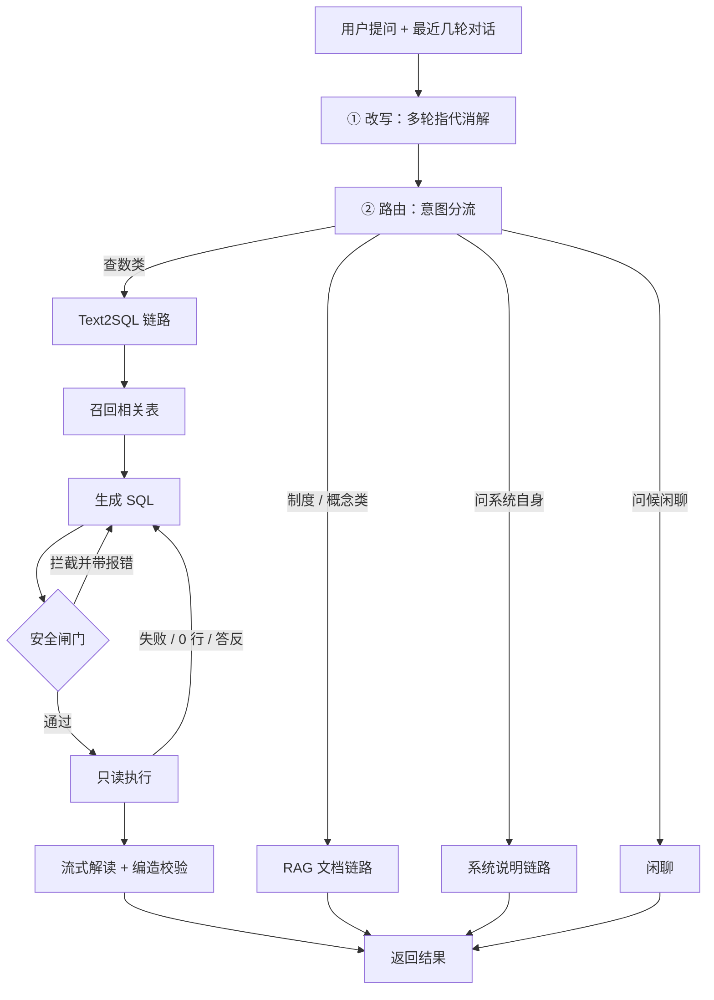

:::note
**先说清楚这套系统要解决什么**
我在上海银行对公授信方向做了一个智能问答系统。它在原来的 RAG 知识库之上做了一次改造：加了一层意图路由，文档类问题走知识库检索，数据统计类问题走 Text2SQL 直接查对公授信业务库。整个系统的编排是一条确定性的状态流水线，Text2SQL 链路带自纠正回边，SQL 写错了能自己发现、自己改、再执行，执行前还有一道语法树级的安全闸门。前端能展示生成的 SQL、结果表格、图表和完整执行轨迹，每一步可核验。
:::

## 一、项目是什么：从一个真实痛点出发

对公授信条线的客户经理和审查岗**不具备 SQL 能力**。他们日常要看的都是"数"，各分行敞口排名、不良率趋势、集团集中度，以前的做法是提需求给数据团队，等一两天拿到一张静态报表。问题稍微变一下口径（"那按分行呢"），又得重新排一次队。

另一边，我们已经有一套 RAG 系统，但它只能回答"制度怎么规定的"这类问题。用户真正高频问的其实是"数是多少"。

从第一性原理看，这两类问题的知识形态完全不同：

- 制度、口径、流程 → 静态陈述，存在文档里，答案是从文本里"检索"出来的
- 余额、笔数、比率 → 动态事实，存在数据库里，答案是要"计算"出来的

知识形态不同，检索路径就必然不同。文档检索拿文本片段没法回答"不良率是多少"，让 Text2SQL 去查制度条文更是南辕北辙。所以架构上不是给 RAG 加个功能，而是在同一个入口后面分出两条链路，由上游一个路由节点决定走哪条。路由要解决的，就是判断用户问的是事实还是陈述。

## 二、整体架构：一个入口，四条出口

四条出口分别是什么：

- **Text2SQL（查数）**：问题需要拿业务库里的实际数据算出来，比如排名、占比、趋势、明细。
- **RAG（查制度/概念）**：问题问的是"规定应该怎样""某个概念是什么"，答案在制度文档里。
- **系统说明（meta）**：问的是系统自己，比如"你有哪些数据库 / 哪些表 / 什么字段 / 能问什么"，这类答案就藏在系统的数据字典里，不调模型、不查库，直接程序拼装。
- **闲聊**：纯问候，不进任何业务链路。

后端是一条确定性的状态流水线：一次分流 + 一条带重试的流水线，节点之间只传状态，不靠模型临场决定下一步。Text2SQL 链路还带一条自纠正回边，SQL 写错了能自己发现、自己改、再执行。

业务库是对公授信场景的 12 张表（机构 / 客户经理 / 企业客户 / 财务年报 / 授信申请批复 / 授信台账 / 放款还款 / 担保 / 五级分类快照 / 集团客户），约 12.9 万行合成数据，覆盖贷前到贷后全流程。造数刻意不用均匀随机，金额按对数正态分布、五级分类按季度快照单向恶化、不良率和通过率都锚定真实量级，不然演示数据一眼假。

## 三、从一次提问走完整条主干流程

这一章是重点。每条流程都配一个"真实问题进来后发生了什么"的走查。

### 3.1 改写：只在"追问"时才动模型

**触发条件（三个同时满足）**：有历史对话，且当前这句被判定为依赖上下文的追问，且能从上一轮翻出一个用户问题作为"前文"。

判定的两条路：

- 句子里出现指代/省略标志词（那 / 呢 / 还有 / 上面 / 刚才 / 换成 / 再按…）
- 句子极短（≤10 字）且自身没有任何业务话题

**例子（触发）**：
> 上一轮用户问：「当前不良授信按行业分布」
> 这一轮用户问：「那按分行呢」
> → 改写成独立问题：「当前不良授信按分行分布」

**例子（不触发）**：
> 用户首轮直接问：「列出敞口前 10 名」
> → 虽然只有 9 个字，但自带业务词，不会被当成追问，不改写。这是当时踩坑把长度阈值从 18 调到 10 的原因：阈值太大会把完整短问句误判成追问，反而把好问题改坏。

改写还有一道兜底：改写结果长度异常或和原文一样，就退回原问题。绝大多数单轮提问零额外开销。

### 3.2 路由：规则优先，模型兜底，保守默认

顺序是三挡，和你直觉的"先调模型再降级正则"相反：

1. **规则先跑**：关键词匹配，能判定就直接返回，毫秒级、零成本、还能告诉用户"命中了哪些词所以走查库"。命中就根本不调模型。
2. **规则拿不准才调模型**：用分类提示词吐出"走哪条链路 + 理由 + 置信度"。
3. **模型也失败**（超时 / 解析异常）才真正降级：保守走文档检索，宁可让用户去查文档，也别误查库吐一堆不相关数据。

四条去向各自一个例子：

| 问题 | 命中信号 | 走哪条 |
|---|---|---|
| 「各分行不良率排名是多少」 | 业务词（不良率）+ 统计词（排名） | Text2SQL |
| 「抵质押率一般要求多少」 | 制度问法（要求 / 一般）压过统计词 | RAG |
| 「什么是五级分类」 | 定义问法（什么是），无统计词 | RAG |
| 「有哪些表 / 什么字段 / 推荐几个问题」 | 问系统自身 | 系统说明（meta） |
| 「你好」 | 问候 | 闲聊 |

:::tip
**为什么路由用关键词规则而不是直接上分类模型？**
规则毫秒级、零成本、可解释（能告诉用户"命中了哪些词"）、可回归测试。误判驱动地补词表，准确率收敛很快。分类模型要训练数据、有延迟、错了还没法解释给用户听。等规则真的收敛不动了再考虑模型，而不是一开始就上重型方案。先量一下规则的覆盖率再决定，很多场景规则根本够用。
:::

### 3.3 RAG 链路：查制度文档

**流程**：路由判定为文档类 → 检索知识库（双路召回 + 重排）→ 取最相关的文本片段 → 让模型基于片段生成回答 → 流式输出。

**例子**：
> 用户问：「授信审批流程是什么」
> → 路由判为 RAG（问的是流程/制度，无统计意图）
> → 从制度文档里召回"授信审批流程"相关段落
> → 模型基于这些段落组织成一段可读回答
> → 前端展示来源文档 + 正文

这一条不是本次改造的重点，完整的 RAG 处理流程（切块、召回、评测和多租户隔离）另有记录。

### 3.4 Text2SQL 链路：查业务库

这条链路是整个系统最复杂、也最值得讲清楚的地方。下面用一个真实问题把六个子步骤串起来。

**例子**：用户问「各分行不良率排名」

**① 召回相关表**
不是把 12 张表的说明全塞给模型（那样约 3000+ token 且无关表会干扰 JOIN），而是按问题精选：关键词打分选种子表 → 沿外键关系自动补全 JOIN 必需的桥表 → 补上明细表必定依赖的上级主表。最后只送 ≤6 张表的说明进提示词。
> 本例：命中"分行/不良率" → 召回授信台账、企业客户、五级分类等核心表，并自动带上它们 JOIN 所需的桥表。

**② 生成 SQL**
模型在"精简过的可用表 + 业务口径"之上写出 SQL。业务口径是沉淀下来的硬规则（机构三级层级、算比率不能按被统计字段分组、时间基准取哪一期等），few-shot 里专门给计算型指标示范。

**③ 安全闸门**
生成的 SQL 一律不可信，执行前过一道语法树级校验：只放行 SELECT 这类只读查询，禁止任何写入/改结构语句，禁止 `SELECT *`，危险系统函数拦截，表名必须在白名单内，未写行数上限的自动补上。

**④ 只读执行**
用只读模式打开的数据库连接去跑，即便 SQL 漏过闸门也写不进任何数据；同时限制单次返回的行数上限和查询超时，防止一个大查询把数据库或服务拖垮。执行结果出来后，还会从 SQL 里反查出"每张表实际动用了哪些字段"，给前端小白展示"这个数是从哪张表的哪些字段算出来的"。

**⑤ 自纠正（关键）**
SQL 生成 → 校验 → 执行，任何一步失败都带着报错原文回到生成节点重试（上限 2 次）。报错信息本身就是最好的纠错材料。比如"列 xxx 不存在，可用列有：……"就比"再想想"有效一个数量级。还有两个容易漏的判定：
- **返回 0 行也算失败**：SQL 没错但一行都没有，几乎总是筛选假设错了（比如授信全挂在支行，模型却按"分行"过滤）。空表返回给用户只会觉得系统坏了。
- **比较类守门**：用户问"武汉分行是不是第一"，模型若写成 `WHERE 机构='武汉分行'` 只取一行，结果里没有对比依据，解读只能迎合着说"确实第一"，结论可能是反的。代码会识别"问题含比较词 + SQL 把问题里的主体过滤成唯一行"并强制打回重生成。

**⑥ 解读输出**
结果表格 + 图表（按数据形状自动选：时间列→折线、占比语义→饼图、分类对比→柱状）送模型做流式解读，并带一步编造校验：把解读里出现的每个大数字和查询结果的数值白名单比对，命中编造就整段扔掉降级为确定性摘要（把首行数据如实念出来）。宁可干巴的真话，不要漂亮的假话。

:::tip
**自纠正重试上限为什么是 2 次，而不是 1 次或 5 次？**
实测下来，大部分错误是字段拼写和 JOIN 路径问题，一轮就能修好（0 行触发的重新生成也是）。两轮还修不通，说明问题本身问得含糊或者召回就错了，继续烧钱大概率还是错，不如降级给用户一句"没查到，你可以试试这样问"。上限的确定依据是错误类型的分布，不是拍脑袋。
:::

### 3.5 系统说明（meta）链路：问系统自身

**流程**：识别到问题在问系统的能力/数据范围 → 直接从系统的数据字典拼装答案（有哪些表、每张表什么含义、有哪些字段、推荐几个能问的问题）→ 返回，不调模型、不查业务库。

**例子**：
> 用户问：「目前有哪些数据库 有什么字段 推荐什么问题」
> → 路由判为 meta
> → 程序从数据字典取出 12 张表清单 + 字段说明 + 预设的推荐问题
> → 直接拼成回答

为什么要单独分出来：这类问题曾被误判进 Text2SQL，模型为了"答"而编造 UNION 查询，被安全闸门拦下，最后反而建议用户"请提供表名"，典型的把简单问题搞复杂。答案明明就在系统自己手里，根本不需要模型或数据库。

### 3.6 闲聊

纯问候（你好 / 谢谢），短句 + 问候词即判定，不进任何业务链路，直接一句礼貌回复。

## 四、兜底机制：为什么到处都是退路

先想清楚一个底层约束：LLM 的输出是概率分布，不是函数返回值。同样的输入，可能对也可能错。所以这个系统里所有"把 LLM 输出直接当结果用"的地方都埋了雷，兜底的本质，就是假设每一环上一步都可能给你垃圾。

### 4.1 路由层：规则优先，模型兜底

关键词规则能判定 80% 以上的问题（业务词 + 统计词命中），毫秒级且零成本；只有规则拿不准的才交给模型。反过来做（全走模型）等于每个问题都先花一次调用，还引入不必要的错误率。

### 4.2 生成层：自纠正回边

SQL 生成 → 校验 → 执行，任何一步失败都带着报错原文回到生成节点重试，上限 2 次（见 3.4）。报错信息本身就是最好的纠错材料。

还有一个容易漏的判定：返回 0 行也按失败处理（筛选假设错了，详见 3.4）。

### 4.3 安全层：三层防线（纵深防御）

模型写的 SQL 一律不可信，这是前提。三层，每一层防的威胁不同，是纵深关系而非互为备份：

1. **语法树白名单**：把 SQL 解析成语法树后按语句类型判定，只准单条只读查询、禁 `SELECT *`、表名必须在白名单、危险系统函数拦截、自动补行数上限。不用正则的原因见 设计决策
2. **只读连接**：数据库以只读方式打开，就算闸门漏了也写不进任何数据
3. **行数硬截断 + 超时**：限制单次返回行数和查询耗时，防止一个大查询把服务拖死

### 4.4 解读层：编造校验 + 三级降级

解读正文生成后有一步机械核对：把解读里出现的每个大数字捞出来，和查询结果的数值白名单比对（排名次序、两数之差这类合法加工放行）。命中编造 → 整段扔掉，降级为确定性摘要。生成失败的降级链：流式失败 → 退非流式 → 还失败 → 退确定性摘要。用户永远能看到一条有内容的回答。

### 4.5 编排层与前端的兜底

- 编排门面按配置选实现，主实现装不上就自动降级到备用实现并打警告。编排层不该成为整条链路的单点故障
- 前端：响应异常直接进错误态（否则留下永远空白的气泡）；切换会话/清空时中断旧的数据流（否则旧流数据串进新回合）；事件按回合归属绑定
- RAG 侧：向量库不可用时走降级分支明确告知，快速解析超限自动转深度解析

:::tip
**一句话总结兜底哲学**
每一层兜底都对应一个"假设被打破"的场景：假设模型不犯错（打破→自纠正）、假设闸门不漏（打破→只读）、假设解读诚实（打破→编造校验）。兜底不是堆 try-except，是先把系统里所有"信任"列出来，再逐个决定要不要信。
:::

## 五、设计决策与权衡

### 决策 1：编排层——框架 vs 手写

- **背景**：链路形状在设计期就定死了，一次分流 + 一条带重试的流水线，秒级完成，不需要运行时动态拆解任务
- **选择**：用一种流程编排框架做主实现，同时保留一份纯手写版，门面按配置切换；两个实现的事件序列有对照测试强制校验，切换零风险
- **取舍**：框架的声明式控制流直读，节点独立可单测；代价是放弃了长周期任务的调试和恢复能力，但我最长链路是秒级的，那些能力用不上。保留手写版的真正原因，是它证明了编排只是可替换的壳，框架不是系统的地基。节点是纯函数，真要迁移只改编排层

一个常见的设计问题是“为什么不用 XX 框架”。这里的答案不是“太复杂”，而是：它的复杂度是为长周期、强审计场景付的账，而当前流程不需要这些能力；节点已经保持为纯函数，后续真要迁移时只需要替换编排层。

### 决策 2：schema 召回 vs 全量 DDL

12 张表的说明全塞进提示词约 3000+ token，而且实测表越多模型写错 JOIN 的概率越高，表之间会互相干扰。改成按问题召回 2~4 张：关键词打分选种子表，再沿外键关系自动补全 JOIN 必需的桥表。这里踩过一个坑：集团查询只命中"集团"一个词，召回了集团表但没带桥表，模型没有 JOIN 路径就开始臆造不存在的列（详见 六、踩过的坑）。

### 决策 3：SQL 安全——语法树而不是正则

正则拦 SQL 是打地鼠：注释绕过、子查询藏写入语句、列名误杀（带 update 的字段名撞上 UPDATE 关键字）、编码空白，每个都是绕过点，而且永远列不全。语法树在解析阶段把注释、编码、空白全部归一化，只按语句类型判定，判断是可穷尽的。代价是要引一个 SQL 解析依赖、性能略差，不过安全场景下这个代价可以忽略。

### 决策 4：脱敏在出库后做，不写进 SQL

在 SQL 里脱敏会逼模型生成复杂表达式，生成准确率显著下降，而且脱敏逻辑散落在每条 SQL 里没法统一审计。改成结果出库后按列名套规则，SQL 保持简单。顺带踩过一个业务域的坑：客户名在零售库里是个人姓名要脱敏，在对公库里是企业名称，公开登记信息，打码了结果就没法看。同名字段在不同业务域语义完全不同，凭字段名套规则会翻车。

### 决策 5：模型选型——非推理模型

实测数据（同一 SQL 生成任务）：

| 模型 | 耗时 | 类型 | 结果 |
|---|---|---|---|
| 某推理模型 A | 27.6s | 推理 | 正确但极慢 |
| 某 72B 指令模型 | 3.8s | 非推理 | 正确 |
| 某 30B 代码模型（在用） | ~4s | 非推理 | 正确 |
| 某 4B 小模型 | 预算加到 5000 token | 推理 | 正文始终 0 字 |

推理模型的思维链和正文共用输出预算，预算小了正文必空；小模型的思维链还会原地打转，加预算也没用。更根本的一点：Text2SQL 需要的"推理"已经被外置了。机构三级层级要自连接、算比率不能按被统计字段分组，这些口径全写死在提示词的业务规则里，模型不需要自己想。选型不看出身，看任务形状。

### 决策 6：正文真流式 + 编造校验的冲突取舍

原来正文是"一次性生成完切段推出"的假流式。改成真流式后遇到一个矛盾：流式要求边生成边推，编造校验却要求收齐再核对。最终选择首字延迟约 2 秒，换"每个数字都被核实过"。同时立了两条规矩：流式里只取正文增量（推理模型的内心独白不播给用户）；一旦吐出过内容就不再重试（重试会让用户看到两段重复）。

## 六、踩过的坑

每个问题都按“现象 → 根因 → 修复”记录，后续复盘时可以直接看出问题是在哪一层出现的。

### 6.1 迎合式断言：系统顺着用户说错话

- **现象**：用户问"武汉分行是不是第一"，系统查出正确数字却答"确实位居首位"，实际第一是另一家分行
- **根因**：三层叠加。① SQL 写成只取武汉一行，结果里没有任何对比依据，解读只能迎合；② 打回重生成后，模型受上一轮对话影响，把"集团排名"偷换成"各分行排名"，答非所问；③ 更早的时候，这类问题只召回 1 张表，模型没有 JOIN 路径直接臆造列名，三连败降级
- **修复**：召回加桥表补全（修 ③）；代码级守门，问题含比较词且 SQL 把问题里的实体过滤成唯一行 → 强制打回（修 ①，prompt 里写了口径但拦不住，升级为代码）；业务口径加"排序维度必须与被比较主体一致"（修 ②）
- **教训**：错答不报错、数据也"正常"，但结论是反的，这类错误比崩溃危险得多。解法不能只靠 prompt，编出去的答案收不回来

:::tip
**为什么这个 bug 值得单独记录？**
因为它暴露的是 LLM 应用的一个本质问题：模型有迎合用户立场的倾向（sycophancy）。排查过程横跨召回、生成、解读三层，最后落成"代码级守门 + prompt 口径"的双保险。能讲清为什么 prompt 不够、为什么打回的代价可以接受（多一轮自纠正 vs 把答案答反，两侧代价不对称所以宁可保守），比背十个概念有说服力。
:::

### 6.2 编造数字：解读里冒出结果里没有的数

- **现象**：查询结果只有一行通过率，解读写出"通过的平均金额 X、拒绝的平均 Y"，两个数全是编的
- **根因**：模型把"编数字"绕开了，它没编数字，编的是趋势和对比（"同比下降""行业间差异明显"），prompt 写"不许编造数据里没有的数字"拦不住这类变体；换代码模型后倾向更强
- **修复**：两层。结果数值做成白名单写进 prompt（"不许编"从抽象要求变成可对照的具体边界）；生成后代码逐数核对，命中即降级。实测抓到过一次现行
- **教训**：对 LLM 的约束，写规则不如给边界；给边界不如加校验

### 6.3 机构层级：SQL 没错但查空

- **现象**："各分行的敞口排名"返回 0 行
- **根因**：机构是三级层级（总行→分行→支行），授信全挂在支行上。模型按"分行"过滤，当然查空。数据没错、SQL 也没语法错，是模型不知道数据的组织方式
- **修复**：业务口径里显式声明三级层级 + 自连接取上级机构的示例；配合"0 行视为可疑触发重生成"
- **教训**：Text2SQL 里模型缺的不是 SQL 语法，是业务语义。数据字典里每条业务口径都是一次"线上算错 → 排查 → 修正"的沉淀

### 6.4 比率算成 100%

- **现象**："审批通过率是多少"返回 100%
- **根因**：模型多写了按决策结果分组，分组后每组内部占比恒等于 100%。这是经典陷阱：算占比时按被统计字段分组，分母就被切碎了
- **修复**：业务口径写明"算比率不按被统计字段分组"，用条件聚合
- **教训**：比率、排名、占比这类"计算型指标"是 Text2SQL 的高发错区，示例里要专门给

### 6.5 单位丢失引发幻觉

- **现象**：模型把 100.4 万（万元单位）写成"100.4 万元"以外的数字，擅自换算
- **根因**：列标签映射里聚合别名丢了单位。模型看到没有单位的列名，自由发挥换算
- **修复**：标签组合时保留基列单位；解读提示词里硬性要求"原样引用数字并标注单位，禁止任何换算"
- **教训**：给模型的每一份数据都要带完整语义，缺一个单位就是给它一次发挥的空间

### 6.6 路由误判（两轮演进）

- **第一轮**："什么是五级分类"被判成查库，业务词优先级压过了问法。修法：把"制度问法"（不可覆盖）和"定义问法"（可被统计词覆盖）拆成两组
- **第二轮**："不良率最高的三个行业是什么"被判成查文档，句尾"是什么"压过了"最高"。修法：定义问法可被强统计意图覆盖
- **教训**：路由规则的演进全靠误判驱动的回归用例。改词表必须跑回归

### 6.7 环境与框架问题

- 依赖安装在本机 Windows 上会卡死在卸载阶段，诊断要看安装目录的时间戳而不是日志（日志是块缓冲严重滞后）；改用更快的安装器绕开
- 流程编排框架要求状态模型带特定标识字段，否则运行时分支判断会出错；声明式路由在某些组合下会在分支执行前就触发，拿到空状态
- 状态模型默认不在赋值时校验，脏数据一路带到底才炸，开启赋值即校验

## 七、把关键设计再串起来

### 7.1 RAG 链路

RAG 链路的切块、召回、评测和多租户隔离另有记录，这里只看本次改造后新增的点：

- **为什么不把 RAG 和 Text2SQL 做成一个 Agent 的两个 tool？** 我的链路形状是设计期定死的两条路，用路由分流足够；tool-calling 适合"需要模型自己决定调什么"的场景。这是 workflow 和 agentic 的边界判断
- **多轮上下文怎么做的？** 前端发最近几轮滑窗，后端检测到追问才改写（"那按分行呢"→"当前不良授信按分行分布"）。判定错了会把好问题改坏，所以判据很克制：指代词命中，或极短且自身无话题。效果有对照：带历史时 SQL 正确继承"不良"口径，不带就丢口径，这个对照比一句"支持多轮"更能说明问题
- **合规考虑？** 结果出库后按列脱敏 + 查询审计（每次查了什么 SQL、谁查的、耗时多少，全落盘）+ SQL 白名单。金融场景"可审计"和"正确"同级别重要

### 7.2 Text2SQL 链路

**Text2SQL 的基本流程是什么？**

判断要不要查 → 召回相关表 → 生成 SQL → 安全校验 → 只读执行 → 错了带着报错改（≤2 次）→ 结果转人话。核心认知就一句话：难点不在生成 SQL，在生成之后。写错了能自纠、危险语句能拦住、含糊问题不硬答，这三件事才是工程量所在。

**怎么保证生成的 SQL 是安全的？**

三层纵深：语法树白名单（只准单条只读查询、表名白名单、禁 `SELECT *`、自动补行数上限）→ 只读连接 → 行数截断 + 超时。强调语法树对正则的可穷尽性优势。

**准确率怎么保证 / 怎么排查错误？**

- 静态：业务口径（踩坑换来的规则）+ 枚举值接地（把每个枚举字段的真实取值写进提示词，模型不能用近义词）+ 时间基准（数据到哪天、"当前"是哪一期）+ JOIN 路径图
- 动态：自纠正回边 + 0 行可疑判定 + 比较类守门
- 有一套端到端回归 + 路由回归，改提示词必须跑

**为什么提示词这么长？**

不是堆的。每一段都有明确职责：表结构（召回后的 2~4 张）、业务口径（每条对应一次真实错误）、枚举取值（防近义词）、JOIN 路径（防臆造列）、示例（计算型指标示范）。能说清每一段"防的是哪个错误"，长就不是问题。提示词长度换准确率，这个 trade 我认。

**LLM 幻觉怎么治理？**

分层：结构化输出（SQL）用白名单 + 语法树校验兜底；自然语言输出（解读）用数值白名单 + 事后逐数核对，命中编造降级为确定性摘要。核心理念：对模型的约束，写规则不如给边界，给边界不如加校验。

**流式是真的吗？**

事件级（SQL、表格、图表）天然是真流式，后端做到哪推到哪。正文一开始是假流式（生成完切段），后来改成真流式，过程中处理了三个点：内心独白过滤、重试边界（吐过内容不再重试）、真流式与事后校验的冲突（选了首字延迟 2 秒）。

**流程编排框架和 Agent 协作框架有什么区别？为什么这么选？**

前者管"步骤的顺序"，后者管"某一步内部多个角色怎么协作"，两者是嵌套关系，不是竞品。我的主干是确定性流水线，全部用前者；现有每一步都是单次模型调用能完成的确定性任务，硬塞多角色协作是慢几倍买一个更不稳定的结果。多角色协作留给步骤不固定的开放式分析（比如风险归因：核验员拉数 → 归因员找规律 → 撰写员成文）。不会为了用多 agent 而把一个单次调用能解决的任务拆成多个角色，那是负优化。

## 八、当前边界与后续改进

- **澄清机制没做**：问题含糊时应该反问而不是硬猜，需要新增链路分支和前端交互。现在的兜底是"查不到给可执行的改进建议"，算低配版
- **审计还是落本地文件**：并发写、按会话查询都撑不住，计划迁数据库审计表
- **评测体系偏薄**：回归用例是人肉挑的，不是系统性评测集（对比 RAG 侧有 90% 召回率的评测）
- **真·多会话**：前端目前是单会话 + 历史索引，按会话存取历史需要数据表扩展

这些边界对应的是当前实现的取舍：先把正确性做扎实，再补澄清交互、审计基础设施和多会话能力。

## 延伸阅读

- 银行 RAG 系统 —— RAG 链路的切块、召回、评测和多租户隔离
- 工程化方法论 —— 兜底/降级思想的通用版

#Text2SQL #RAG #Agent #项目复盘 #上海银行
